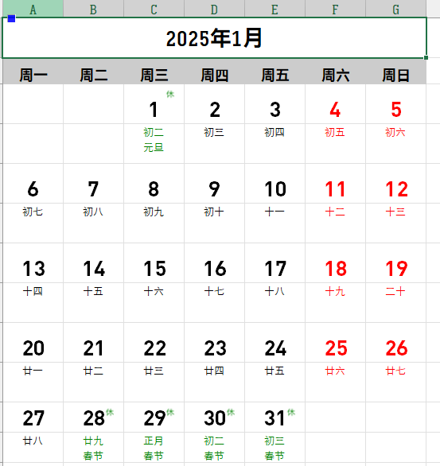

# 中国农历日历生成器

一个基于Python的中国农历日历生成器，可以生成包含农历、节假日和休息日标记的Excel格式日历。

## 预览



## 功能特点

- 支持生成单月或全年日历
- 包含农历日期显示
- 显示法定节假日和自定义节假日
- 节假日使用"休"字标记
- 支持通过配置文件自定义样式和布局
- 周末和节假日使用不同颜色标记
- 支持自定义公历和农历节日

## 安装

### 方法1：直接下载

1. 下载此仓库的ZIP文件
2. 解压到本地文件夹
3. 按照[快速开始](#快速开始)部分的说明操作

### 方法2：使用Git

```bash
# 克隆仓库
git clone https://github.com/zghk/chinese_calendar.git

# 进入项目目录
cd chinese-calendar

# 安装依赖
install_deps.bat
```

## 快速开始

1. 安装Python环境（推荐Python 3.9+）

2. 运行安装脚本：
   ```bash
   install_deps.bat
   ```

3. 生成日历：
   ```bash
   # 生成2024年日历
   gen_2024.bat
   
   # 生成2025年日历
   gen_2025.bat
   
   # 生成自定义年份日历
   gen_calendar.bat
   ```

## 配置说明

编辑 `config.json` 文件可以自定义日历的样式和内容：

1. 基本设置
   - `column_width`: Excel列宽
   - `year`: 默认年份

2. 样式设置
   - 标题样式（title）
   - 星期样式（weekday）
   - 日期样式（date）
   - 农历样式（lunar）

3. 布局设置
   - 行高（row_heights）
   - "休"字图片设置（rest_mark）

4. 自定义节假日
   - 公历节日（solar）
   - 农历节日（lunar）

配置文件示例：
```json
{
    "column_width": 8.5,
    "year": 2025,
    "styles": {
        "title": {
            "font_name": "微软雅黑",
            "font_size": 16,
            "bold": true
        }
    },
    "custom_holidays": {
        "solar": {
            "0101": "元旦",
            "0501": "劳动节"
        },
        "lunar": {
            "0101": "春节",
            "0505": "端午节"
        }
    }
}
```

## 系统要求

- Windows 操作系统
- Python 3.9 或更高版本
- 安装的依赖库：
  - openpyxl 3.0.10
  - Pillow 9.5.0
  - lunar-python 1.3.12
  - requests 2.28.2

## 注意事项

1. 确保系统安装了所需的字体：
   - 微软雅黑
   - 华文细黑（用于"休"字标记）
   - DINPro-Bold（用于日期显示）

2. 如果要使用在线节假日数据，需要确保网络连接正常

3. 生成的Excel文件可以用Microsoft Excel或WPS打开

4. 如果需要使用SVG图片，可以：
   - 先生成日历文件
   - 然后手动替换"休"字为SVG图片

## 常见问题

1. 如果出现字体相关错误，请检查系统是否安装了相应字体
2. 如果出现网络错误，程序会使用配置文件中的节假日数据
3. 如果需要修改"休"字的位置，可以在配置文件中调整 `offset_x` 和 `offset_y`

## 项目结构

```
chinese-calendar/
├── chinese_calendar.py   # 主程序
├── config.json          # 配置文件
├── install_deps.bat     # 依赖安装脚本
├── gen_2024.bat        # 2024年日历生成脚本
├── gen_2025.bat        # 2025年日历生成脚本
├── gen_calendar.bat    # 自定义年份日历生成脚本
├── docs/               # 文档
│   └── images/         # 示例图片
├── LICENSE             # MIT许可证
└── README.md          # 说明文档
```

## 贡献指南

欢迎提交 Pull Request 或创建 Issue！

1. Fork 本仓库
2. 创建你的特性分支 (`git checkout -b feature/AmazingFeature`)
3. 提交你的改动 (`git commit -m 'Add some AmazingFeature'`)
4. 推送到分支 (`git push origin feature/AmazingFeature`)
5. 创建一个 Pull Request

## 更新日志

### v1.0.2 (2025-01-02)
- 优化了日历布局
  - 隐藏网格线
  - 添加粗边框
  - 调整日期位置
  - 优化星期标题对齐方式

### v1.0.1 (2025-01-02)
- 修复了日历最后一行行高不一致的问题
- 优化了样式配置的应用逻辑
- 简化了"休"字图片生成方式

### v1.0.0 (2025-01-02)
- 初始版本发布
- 支持生成单月和全年日历
- 支持自定义节假日和样式

## 许可证

本项目采用 MIT 许可证 - 查看 [LICENSE](LICENSE) 文件了解详情 "# chinese_calendar" 
